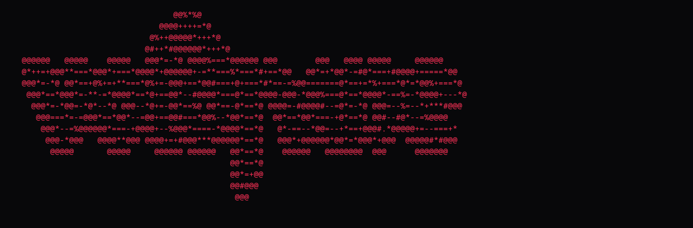

# deadcolors

Custom `pokemon-colorscripts`-style ASCII cycler for terminal rice.




## Install

Clone the repo, then either run it directly:

```bash
python3 deadcolors/__main__.py -r
```

or put a tiny launcher somewhere on your `PATH`:

```bash
#!/usr/bin/env bash
exec python3 "$HOME/path/to/deadcolors/deadcolors/__main__.py" "$@"
```

## Usage

```bash
deadcolors
deadcolors -r
deadcolors --title --center
deadcolors --list
deadcolors --name raw-paste-01
deadcolors --palette blood
deadcolors --palette toxic
deadcolors --plain
```

## Art Sources

By default, `deadcolors` reads:

```text
~/.config/deadcolors/ascii.txt
~/.config/deadcolors/ascii.d/*.txt
```

You can also point it at a repo-local pack:

```bash
python3 deadcolors/__main__.py --file examples/ascii.txt --name raw-paste-01
```

## Pack Format

Paste multiple drawings into one file and separate them with `%%%`.

```text
%%% sentinel
 /\_/\
( x.x )
 > ^ <

%%% terminal-saint
[your next ascii here]
```

You can also drop one drawing per file into:

```text
~/.config/deadcolors/ascii.d/*.txt
```

The file name becomes the script name. Inside a file, an optional first line like
`# name: sentinel` or `name: sentinel` overrides the name.

## Shell Startup

Add this to `~/.bashrc` for a random script when a new interactive terminal opens:

```bash
[[ $- == *i* ]] && command -v deadcolors >/dev/null && deadcolors -r --center
```

## Notes

Use a real monospace font. For browser rendering, put ASCII inside `<pre>` and set
`white-space: pre`, `tab-size: 4`, `letter-spacing: 0`, and a monospace `font-family`.
